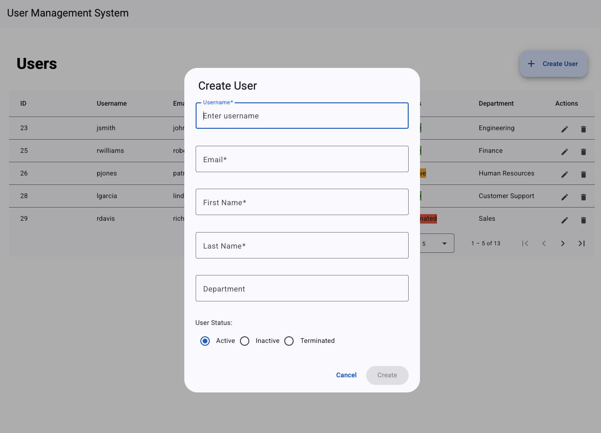

# User Management System

A complete full-stack application for user management with CRUD functionality, providing both a RESTful API backend and a responsive Angular frontend. This project was built for learning purposes to gain hands-on experience with modern frameworks and technologies.



## Project Overview

This project implements a user management system consisting of two main components:

1. **Backend**: A Go-based RESTful API built with Echo framework and using Bun ORM for database operations
2. **Frontend**: An Angular application with a responsive UI for interacting with the backend API

The system allows administrators to create, read, update, and delete user accounts through an intuitive web interface. As a learning project, it demonstrates how to implement full-stack applications using current best practices and cutting-edge frameworks.

## Key Features

- **User Management**:
  - List all users in a grid layout with sorting and filtering
  - Create new user accounts
  - View user details
  - Update existing user information
  - Delete users from the system

- **Validation**:
  - Frontend form validation with clear error messages
  - Backend validation with meaningful error responses

- **Architecture**:
  - Clean, maintainable code following industry best practices
  - Separation of concerns with MVC pattern in the backend
  - Component-based architecture in the frontend
  - Well-documented API with Swagger

## Technology Stack

### Backend

- **Language**: Go 1.22+
- **Web Framework**: Echo
- **Database Access**: Bun ORM
- **CLI Tool**: urfave/cli
- **Documentation**: Swagger
- **Testing**: Ginkgo and Gomega

### Frontend

- **Framework**: Angular 19
- **UI Components**: Angular Material
- **State Management**: Angular services
- **Form Handling**: Reactive Forms
- **HTTP Communication**: HttpClient
- **Testing**: Jasmine and Karma

## Getting Started

### Prerequisites

- Docker and Docker Compose

### Quick Start

The easiest way to run the entire application is using Docker Compose:

```bash
docker compose up
```

This will start both the backend API server and the frontend application with all necessary dependencies.

- The backend API will be available at http://localhost:8081
- The frontend application will be available at http://localhost:8082
- Swagger API documentation will be available at http://localhost:8081/swagger/index.html

## Documentation

Each component of the project has its own detailed README file:

- **Backend**: See `backend/README.md` for detailed information about the Go API, including architecture, CLI commands, and development workflow.
- **Frontend**: See `frontend/README.md` for comprehensive documentation about the Angular application, component structure, and development guides.

## License

This project is licensed under the MIT License - see the LICENSE file for details.

## Acknowledgments

- Echo web framework: https://echo.labstack.com/
- Bun ORM: https://bun.uptrace.dev/
- Angular framework: https://angular.io/
